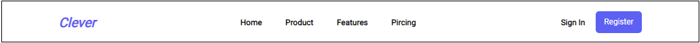

<h1 align="center">😊 BIENVENIDO A MI MENÚ BAR II 😊</h1>

<h2>Descripción</h2>

Esta es una barra de menú solo con **HTML** y estilos **CSS**. 
Se aplicó estilos y animación solo por CSS, logrando el siguente resultado:

Y con los efectos **CSS**, al posicionar el mouse por encima de la barra, la barra cambiará al siguiente resultado:

La idea es lograr el fecto inverso a la barra de menú mostrada inicialmente.

 

**Puede personalizar la barra de menú a su gusto**

Ademas de poder descargar este repositorio y modificar el codigo para obtener el resultado que desee. Puede cambiar algunas variables declaradas en el inicio del archivo <i>styles.css</i> para cambiar a su necesidad el color y las imágenes de la barra de menú.

<i>Variables que puede cambiar en el CSS para dar estilo a su barra de menú</i>
<ul>
    <li><strong>--colorFont:</strong> Color de todas las fuentes de la barra de menú.</li>
    <li><strong>--colorFontSecond:</strong> Color de todas las fuentes de la barra de menú y del fondo del botón al posicionar el mouse por encima de la barra de menú.</li>
    <li><strong>--colorMain:</strong> Color del logo y del botón en la barra de menú cuando el mouse está fuera de ella.</li>
    <li><strong>--colorSecond:</strong> Color del logo y del botón en la barra de menú cuando el mouse está por encima de ella.</li>
    <li><strong>--colorBkgBar:</strong> Color del fondo de la barra de menú.</li>
    <li><strong>--colorBkgCover:</strong> Color del covertos que cubre a la barra de menú cuando el mouse está por encima de ella.</li>
    <li><strong>--colorBkg:</strong> Color del fondo que contiene a la barra de manú.</li>
    <li><strong>--timeTransition:</strong> Tiempo de transición de todos los efectos.</li>
</ul>

 

<h2>Link</h2> 

Acceso directo a la página web del repositorio: <a href="https://jorgekerk.github.io/TP-2022-12-22-MenuBar2/">**Barra de Menú II**</a>

Espero que sea de su agrado, saludos cordiales, <i>**JORGE KERK**</i>.
